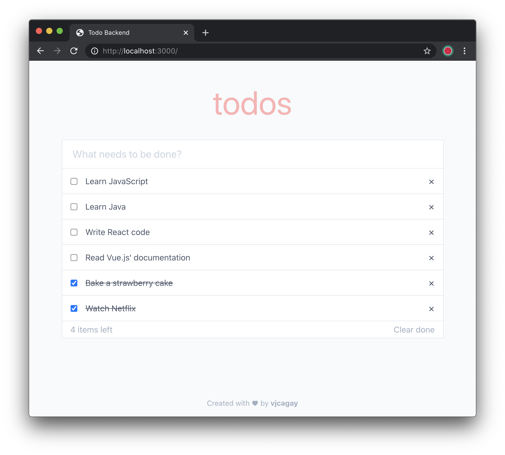

# Todo Backend

This project aims to create todo app implementations demonstrating basic CRUD (create, read, update, delete) operations on several backend programming languages.

Inspired by [TodoMVC](http://todomvc.com), I created this project with the aim of learning new programming languages in a fun way. Simple enough, but still teaches the fundamentals of backend development.

- [x] [JavaScript (Node.js)](backend/javascript/README.md)
- [x] [Java (Spring Boot)](backend/java/README.md)
- [ ] TypeScript
- [ ] Ruby
- [ ] Go
- [ ] PHP
- [ ] Rust
- [ ] C/C++
- [ ] Scala
- [ ] Swift
- [ ] Python

...and many more in the future.

The app, no matter the backend, will connect only into a single MongoDB database and will access the same set of data.

## Screenshot

## Setup

- Make sure that you have MongoDB installed in your system.
- Run `./db/start.sh` to start the local MongoDB server.
- Check out the [frontend documentation](frontend/README.md) for instructions on how to prepare the frontend so that it can be served by the backend code of the language of your choosing.
- Choose a backend language in [`backend`](backend) you want
- Let's rock!

## Author

© Vincent John Cagay

- [https://vjca.gay](https://vjca.gay)
- [https://vjcagay.com](https://vjcagay.com)
